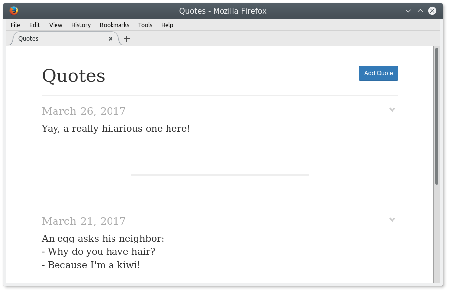
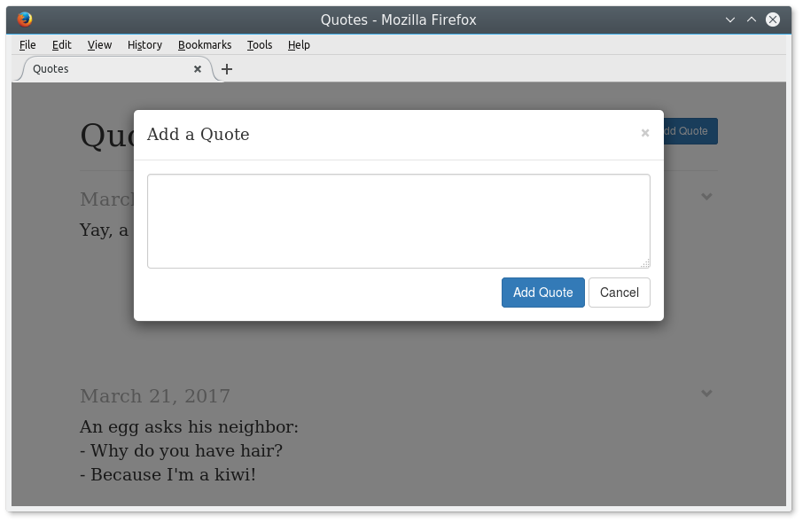

# TMC2

TMC2 is a minimalist quote gathering tool. It has been written to replace an
hosted service, tropmignon.com, which has closed.

It lets you add and browse quotes (or any other short texts).

It explicitly does not support:

- markup
- images
- authentication
- multiple authors
- comments

It looks like this:

## Translations

TMC2 is currently available in French and English.

## Setup

TMC2 depends on Python, Sqlite, Peewee, Flask, Jinja, Arrow and Babel.

To give it a try:

1. Run `make` to create a virtualenv with the required dependencies and
   compile translations
2. Run `make run` to start the app using Flask web server on
   <http://localhost:5000>

By default the database is in `/tmp/tmc2.db`. You should create a configuration
file to define another location. You can then run TMC2 with this other
configuration file by defining the `TMC2_CONFIG` environment variable.

For example:

    $ echo "DATABASE = /var/lib/tmc2.db" > /etc/tmc2.py
    $ echo "HOST = '0.0.0.0'" >> /etc/tmc2.py
    $ make run TMC2_CONFIG=/etc/tmc2.py

Look at <app/config.py> for other configuration options you can define.

There is also a Dockerfile for the project.

## quoteimport.py

The `quoteimport.py` tool in the `app` directory lets you import quotes from a
JSON file. The JSON file must have the following format:

    {
        "quotes": [
            {
                "date": "date-in-iso8601-format",
                "text": "quote text"
            },
            //...
        ]
    }

(This format matches the JSON export format of tropmignon.com)

## Bundled components

TMC2 bundles the following components:
- Bootstrap 3.3.7: <https://github.com/twbs/bootstrap/releases/download/v3.3.7/bootstrap-3.3.7-dist.zip>
- jQuery 3.1.1: <https://code.jquery.com/jquery-3.1.1.min.js>

## License

Apache 2.0
